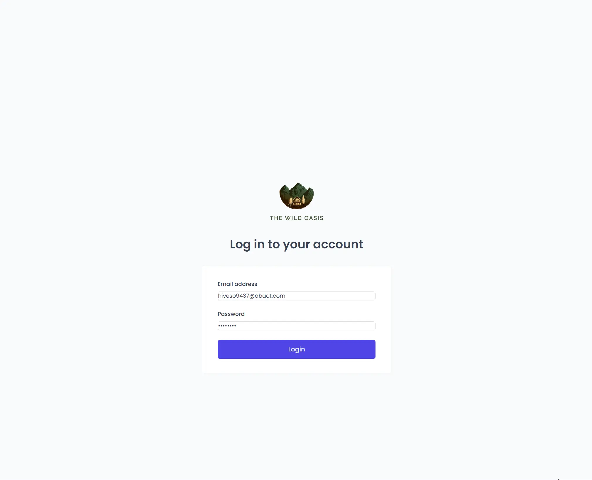

### 👋 **I am Erhan ERTEM**

&emsp;

## Udemy The Ultimate React Course 2024: React, Redux & More by Jonas Schmedtmann

### **Objective:** Create The Wild Oasis App

Key take-aways from this project:

- React folder structure and project planning
- Styling w/ Styled Components
  - Create in-component styled-components
    - Create child styled-component
    - Create parent styled-component AKA \<GlobalStyles />
  - createGlobalStyles Tagged Template Literal - Create global styled-components
    - Provide global styles to the app
    - Experiment w/ css literal prefix hack to get prettier support on the code
  - Experiment w/ & symbol for SASS like feature inside styled components
  - Dynamic styled-components
    - template literals + conditional statements
  - Creating re-usable styled components
    - Propping via 'custom_named' prop
    - Propping via 'as' prop (HTML tag modifier)
    - defaultProps function - Set defaults for the propping type
  - Create styled componenet contemplating a (ReactRouter) component
    - styled() SC function
- React Router

  - Declariative route setup
    - BrowserRouter RR component
    - Routes RR component
    - Route RR component
    - Create index RR route
      - Navigate RR component
      - replace attribute
    - Create wrapper component (routeless) RR route used across multiple routes
      - \<Outlet/> RR component - Have wrapper RR route pass thru child routes

- Tanstack Query

  - Create TQ client
  - Provide TQ client via \<QueryClientProvider/>
  - Query Remote Data
    - 'GET' data w/ useQuery TQ hook
    - 'DELETE' data w/ useMutation TQ hook
      - Get instance of TQ client via useQueryClient TQ hook

- Reach-Hook-Form
  - useForm() RHF hook
    - Standard Form validation RHF rules (required, min, max)
    - Custom(functionalized) Form validation rule (validate)
    - Read values from form fields via getValues() RHF fn to compliment dependant validation challanges

&emsp;

#### [The Wild Oasis App](https://****)

---

